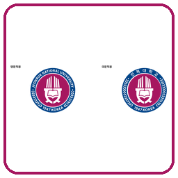
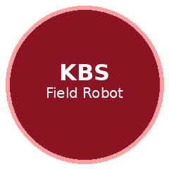

# Sandesh Kumar
### 🤖 AI · Computer Vision · Agricultural Robotics
### 🏠 [GitHub Profile](https://github.com/Sandesh1764)

### _Affiliations_
<table>
<tr>
<td align="center">
<a href="https://robot.jbnu.ac.kr/">

 <strong>Core Research Institute of Intelligent Robots</strong>
 JBNU, South Korea
</a>
</td>
<td align="center">
<a href="https://www.jbnu.ac.kr/">

 <strong>Jeonbuk National University</strong>
 South Korea
</a>
</td>
<td align="center">
<a href="https://news.kbs.co.kr/news/pc/view/view.do?ncd=8365296">

 <strong>Field Weeding Robot</strong>
 Featured on KBS News
</a>
</td>
<td align="center">
<a href="https://www.qau.edu.pk/">

 <strong>Quaid-i-Azam University</strong>
 Islamabad, Pakistan · B.S.
</a>
</td>
</tr>
</table>

---

## 🛠️ **Technology Stack**

\-

## 🎯 **Research Focus Areas**

| **Computer Vision** | **Robotics & Systems** |
|:-------------------:|:----------------------:|
| 🔍 **Semantic Segmentation** | 🤖 **Agricultural Robotics** |
| 🌱 **Precision Agriculture** | ⚙️ **ROS / Edge Deployment** |
| 📏 **Depth & RGB Perception** | 🎯 **Pin-Precision Actuation** |
| 🔄 **Domain Adaptation** | 📡 **Real-time Inference** |
| 🧪 **Knowledge Distillation** | 🚜 **Field Robot Systems** |

---

## 📺 **Featured — Field Robot on KBS**

| Project | Role | Coverage | Paper |
|---------|------|----------|-------|
| **Autonomous Crop-Management / Weeding Robot** | Perception & deep-learning stack (co-author) | [📺 KBS News](https://news.kbs.co.kr/news/pc/view/view.do?ncd=8365296) | [📄 CEA 2025](https://doi.org/10.1016/j.compag.2025.110990) |

Camera → crop/weed perception → pin-precision nozzles → field robot.  
Covered by **KBS** (Sep 2025): *“제초도 스스로”… 피지컬 AI, 농업에서 성과 낼까?*

---

## 📦 **Open Source Projects**

| Repository | Description | Year | Status |
|------------|-------------|------|--------|
| **[pidnet-cropweed](https://github.com/Sandesh1764/pidnet-cropweed)** | Real-time PIDNet-S crop–weed–soil segmentation · **0.887 mIoU** · ~91 FPS | 2025 | ✅ Released |
| **[cropweed-kd](https://github.com/Sandesh1764/cropweed-kd)** | Knowledge distillation · DeepLabV3+ teacher → ResNet18 / MobileNet student | 2025 | ✅ Released |
| **[advent-cropweed](https://github.com/Sandesh1764/advent-cropweed)** | ADVENT unsupervised domain adaptation for crop–weed–soil | 2025 | ✅ Released |
| **[road-lane-detection](https://github.com/Sandesh1764/road-lane-detection)** | Ego-camera road lane segmentation · DeepLabV3 / U-Net++ | 2024 | ✅ Released |
| **[crop-weed-segmentation](https://github.com/Sandesh1764/crop-weed-segmentation)** | UAV Bonn crop vs weed U-Net · Grad-CAM | 2023 | ✅ Released |
| **[face-mask-detection](https://github.com/Sandesh1764/face-mask-detection)** | Face mask detection · OpenCV SSD + MobileNetV2 | 2020 | ✅ Released |

---

## 🖥️ **Systems & Applications**

### **Field / Robot Systems**
| Project | Technology | Demo / Links | Status |
|---------|------------|--------------|--------|
| **Pin-Precision Weeding Robot** | `PyTorch` `OpenCV` `ROS` `Edge AI` | [📺 KBS](https://news.kbs.co.kr/news/pc/view/view.do?ncd=8365296) · [📄 Paper](https://doi.org/10.1016/j.compag.2025.110990) | ✅ Deployed / Featured |
| **Real-time Crop–Weed Perception** | `PIDNet` `DeepLab` `KD` | [pidnet-cropweed](https://github.com/Sandesh1764/pidnet-cropweed) | ✅ Released |

### **Vision Pipelines**
| Project | Stack | Focus | Status |
|---------|-------|-------|--------|
| **Domain-Adaptive Segmentation** | `ADVENT` `PyTorch` | Cross-field / weather shift | ✅ Released |
| **Lane Perception** | `DeepLabV3` `PyTorch` | Ego-camera driving scenes | ✅ Released |

---

## 📊 **GitHub Analytics**

## 🔗 **Connect & Collaborate**

---

**💡 Open to collaboration on Computer Vision, Precision Agriculture, and Field Robotics**

*"Building perception systems that leave the lab and work on real machines outdoors"*

